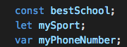
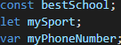
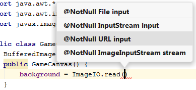

# Techkids guideline cho content viết
## Guideline cho nội dung ảnh

1. Ảnh phải có padding
- Ví dụ hợp lệ:

- Ví dụ không hợp lệ:

2. Với code minh hoạ, nếu không cần kèm theo ảnh hay minh hoạ gì, KHÔNG NÊN DÙNG ẢNH

- Ví dụ không nên dùng ảnh

Mà nên thay bằng 

<pre>
const bestSchool;
let mySport;
var myPhoneNumber;
</pre>

- Ví dụ nên dùng ảnh

